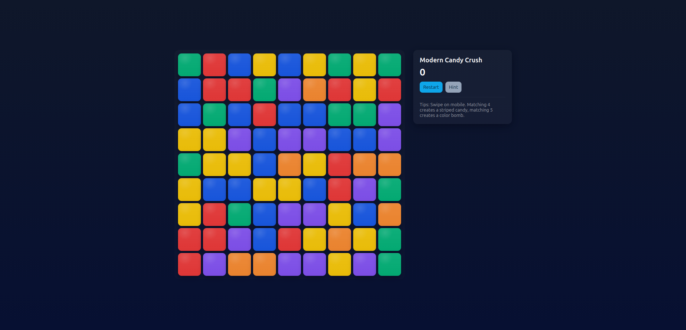

# 🍬 Modern Candy Crush  (Web Edition)

A fully animated, mobile‑friendly Candy Crush‑style matching game built using **HTML, CSS, jQuery, and a custom game engine**.

✔ Smooth animations
✔ Special candies (striped, wrapped, color bomb)
✔ Touch + mouse swipe support
✔ Combo system
✔ Particle explosion effects
✔ Auto‑scaling for mobile devices

---

## 📸 Screenshot




---

## 🚀 Features

* **Match‑3 core gameplay** with cascading tiles
* **Striped Candies** (horizontal + vertical)
* **Wrapped Candies**
* **Color Bomb (5‑match)**
* **Combo multiplier scoring system**
* **Particle explosion effects for candy crush**
* **Responsive layout** (auto tile resizing)
* **Mobile swipe gestures** (touch start/end detection)
* **Hint system** (detects any possible valid move)
* **Restart button**
* **Fully modular JS engine**

---

## 📁 Folder Structure

```
📂 candy
│── index.html
│── style.css
│── script.js
└── README.md
```

---

## 🧩 How to Run

No build tools needed — just open `index.html` in your browser.

### Option 1: Double-click the file

```
open index.html
```

### Option 2: Use VS Code Live Server

1. Install the *Live Server* extension
2. Right-click **index.html** → *Open with Live Server*

---

## 🛠 Technologies Used

* **HTML5** (grid layout)
* **CSS3** (3D transitions, animations, particle effects)
* **JavaScript** (core engine logic)
* **jQuery** (input handling + DOM updates)

---

## 📱 Mobile Compatibility

This game supports:

* Touch dragging & swiping
* Auto‑scaled tile grid
* Dynamic tile‑size detection

---

## 🎮 Controls

| Action       | Device | How to do it               |
| ------------ | ------ | -------------------------- |
| Swap tiles   | Mouse  | Drag one tile onto another |
| Swap tiles   | Mobile | Swipe left/right/up/down   |
| Restart Game | All    | Click **Restart**          |
| Hint         | All    | Click **Hint**             |

---

## 🔧 Engine Overview

The game engine handles:

* Board setup
* Swipe detection
* Adjacent tile swapping
* Match detection (rows + columns)
* Special candy generation
* Explosion rendering
* Gravity collapse
* Refill
* Combo scoring system

All logic is contained inside `script.js`.

---

## 📄 License

This project is open-source. You may modify, use, and publish freely.

---

## ⭐ Contributions

PRs are welcome! Feel free to improve:

* New candy types
* New special effects
* Sound effects
* Level system
* Timed challenges

---

## ❤️ Support

If you like this project, please ⭐ Star the repo on GitHub!
